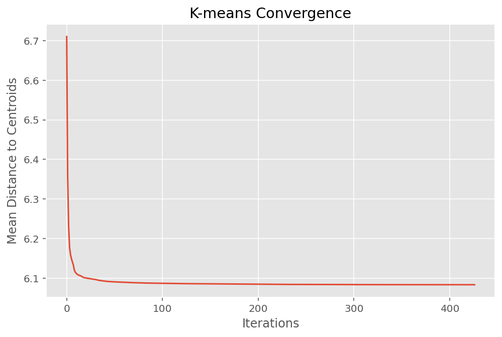

# Lloyd's algorithm for k-Means Clustering  
As a baseline model implement
Lloyd's algorithm for k-means clustering and initialize it with the first k points as
initial cluster centers. The default convergence criteria is to stop the algorithm if none
of the cluster memberships have changed in comparison to the previous iteration.

See [Comparison](#Comparison) for:

 -  Track the number of iterations needed for convergence and compare it to the other implementations.
 -  Report the achieved NMI averaged over at least 5 runs.
 -  Report the runtime in [sec] for your algorithm averaged over at least 5 runs. Also report the number 
  of distance computations performed.

```{r, out.width='33%', fig.align='center', fig.cap="Convergence of k-means.", echo=FALSE}

```


### Briefly discuss your implementation of Lloyds algorithm.
Our `KMeans` class (can be found in `models.py`) implements Lloyd's algorithm for clustering, 
which is a popular method in unsupervised learning. Here's a detailed look at the key components:

- **Initialization**: The constructor `__init__` initializes the `KMeans` instance with a specified 
    number of clusters (`k`). This parameter defines how many distinct clusters the algorithm aims to 
    identify within the dataset.

- **Fitting the Model**
  - *Initial Centroids:* The `fit` method begins by selecting the first *k* points from the dataset `X`
    as initial cluster centers (`centers`) 
    randomly .
  - *Label Assignment:* During each iteration, the algorithm assigns each data point in `X` 
    to the nearest cluster. This assignment is based on Euclidean distance, calculated in 
    the `_assign_clusters` method.
  - *Centroid Recomputation:* After assigning all points to clusters, the cluster centers 
    are recalculated as the mean of the points within each cluster, handled by the `_compute_centers` method.
  - *Convergence Check:* The algorithm iterates until the cluster assignments stop changing from one 
    iteration to the next. It checks for convergence by comparing the current labels with those from the 
    previous iteration.
  - *Convergence History:* It records the average distances from points to their cluster centers 
    over iterations in `convergence_history`, which helps in monitoring the optimization progress.

- **Distance Calculation**: The `_calculate_distances` method computes the pairwise distances between each
   data point in `X` and each cluster center. This calculation is essential for the cluster assignment 
   process.

- **Predicting**: The `fit_predict` method fits the model to the data `X` and returns the cluster 
  assignments for each data point.

- **Efficiency Considerations**: The class tracks the number of iterations (`iterations`) and distance 
  computations (`distance_computations`), providing insights into the computational cost of the model for 
  different configurations of `k` and dataset sizes.

Further information for parameters and returns can be found in the documentation of `KMeans` in 
the file `model.py`.


# k-Means with Locality Sensitive Hashing (LSH)
Implement Lloyd's algorithm using LSH to speed up the distance calculations. 

See [Comparison](#Comparison) for:

 - Report the accuracy using NMI and the runtime in seconds averaged over at least 5 runs. Also report the 
    number of distance computations performed. If your implementation doesn't show a speed-up, discuss why 
    this might be and also discuss whether this situation would change when working larger datasets.
 - Track the number of iterations needed for convergence (if it converges at all) and
    compare it to the other implementations.


### Report how you selected the parameters of LSH and how you combined your functions.
We utilized a grid search approach to optimize the parameters of our LSH implementation, testing various
combinations of the number of hash functions (`nh`), hash size (`hs`), and combination methods (`cm`). The 
parameter combinations we explored included:  

 -  *Number of hash functions* (`nh`): $4, 8, 10$
 -  *Hash Size* (`hs`): $4, 8, 10$
 -  *Combination* (`cm`): `AND`, `OR`

Our objective was to maximize the Normalized Mutual Information (NMI) as the target metric, helping us evaluate 
how well our chosen parameters perform in terms of preserving data similarity within the hashes. 

The final parameters we choose for LSH were:   

 -  `num_hashes`: $4$
 -  `hash_size`: $4$
 -  `combination_method`: `AND`

They achieved a NMI of $0.1892$.

To combine the results of our hash functions effectively, we implemented both 'AND' and 'OR' combination methods:

 - **AND** Combination: This method was implemented to require that all hash bits match for two points to be 
    considered similar, significantly reducing the likelihood of false positives. 
 - **OR** Combination: Alternatively, the OR method allows for any matching hash bit to classify two points as 
    similar, increasing the sensitivity to potential matches and reducing the chance of missing true positives.

### Briefly discuss your implementation of k-means with LSH.
Our `KMeansLSH` class, a specialized extension of the `KMeans` implementation, incorporates Locality-Sensitive 
Hashing (LSH) to enhance clustering performance in high-dimensional data spaces. Here's a detailed look at the 
key components and functionalities:

- **Initialization**: The constructor `__init__` not only initializes the instance with a specified number of 
  clusters (`k`) but also sets up the LSH parameters including the number of hashes (`num_hashes`), hash size 
  (`hash_size`), and the combination method (`AND` or `OR`). This setup allows the class to utilize hash-based 
  methods to speed up the clustering process.

- **Fitting the Model**
  - *Initial Setup*: The `fit` method starts by selecting initial cluster centers from the dataset `X` and 
    setting up the LSH object with our implemented `LSH` class to preprocess the data points.
  - *Hashing Data Points*: Before the clustering begins, all data points are hashed using the `LSH` method 
    specified, grouping them into buckets based on their hash values.
  - *Cluster Assignment*: Instead of computing distances for all data points to all centers, the model first
    checks if the data points are in the same hash bucket as any center, which reduces the number of 
    required distance calculations.
  - *Updating Centers*: The cluster centers are updated by recalculating the mean of the points within each
    cluster after every iteration.
  - *Convergence Check*: The algorithm iterates until the cluster assignments stop changing from one 
    iteration to the next. It checks for convergence by comparing the current labels with those from the 
    previous iteration.
  - *Convergence History*: It records the average distances from points to their cluster centers 
    over iterations in `convergence_history`, which helps in monitoring the optimization progress.

- **Hash-Based Cluster Assignment**: The `_assign_clusters` method leverages hash buckets to pre-group data 
  points and significantly cut down on the computational overhead by limiting the distance calculations to 
  only likely candidate points within the same hash bucket.

- **Efficiency Enhancements**: By integrating LSH, `KMeansLSH` reduces the number of distance calculations 
  needed, especially beneficial in high-dimensional spaces where traditional distance calculations are 
  computationally expensive.

- **Predicting and Performance Metrics**: Like traditional KMeans, after fitting, the labels can be immediately 
  accessed or predicted for new data, with additional metrics available such as the number of iterations 
  (`iterations`) and the total distance computations (`distance_computations`), providing insights into the 
  model's efficiency.

This implementation can be found in the `models.py` file, offering both the robustness
of K-means clustering and the efficiency of LSH for handling large, complex datasets.

Further details on parameter configurations and method functionalities are thoroughly documented in the `KMeansLSH` class within the same file.


Our `LSH` class which was mentioned before implements Locality-Sensitive Hashing (LSH). Here is a short overview:

- **Initialization:** The constructor `__init__` initializes the `LSH` instance with a specified number of 
  hash functions (`num_hashes`), the size of each hash output (`hash_size`), and the dimensionality of the 
  input data (`input_dim`). Each hash function corresponds to a randomly generated hyperplane. These are stored in `planes`, 
  a list where each element is a hyperplane represented by an array.
- **Hash Function:** The `hash` method computes hash values for a given matrix `X`, where each row 
  represents a data point. It utilizes all defined hyperplanes to generate a hash for each data point.
- **Single Hash Computation:** The `_hash_single` method computes a single hash using a specified hyperplane.
  It projects the data points onto the hyperplane and assigns a binary value based on the side of the plane 
  on which each point lies.
- **Combine Hashes:** The `combine_hashes` method combines multiple hash values into a single hash code per data point. This can be done using either the 'AND' or 'OR' combination methods:
  - *AND Method:* Uses logical AND across all hash values.
  - *OR Method:* Uses logical OR across all hash values.
- **Combined Hash Computation:** The `combined_hash` method computes and combines hash values for input data `X` using a specified method (`AND` or `OR`), making it versatile for different use cases.

Further information for parameters and returns can be found in the documentation of `LSH` in 
the file `LSH.py`.

# k-means with coresets
Coresets are a compact representation of data sets,
such that models trained on a coreset are competitive with models trained on the full
dataset. In this task you will implement coresets for k-means clustering as in
Algorithm 1. For the the number of samples *m*, use 100, 1000, and 10000.

Given that we need to form 153 clusters but have a coreset size of only 100, this presents a fundamental
issue: it's not feasible to have more clusters than data points in the coreset. This situation could 
lead to trivial or suboptimal clustering results where many clusters may end up empty or improperly 
defined. Thus, we decided to increase the coreset size to $m=200$ to ensure meaningful and effective clustering.

See [Comparison](#Comparison) for:

 - Report the runtime and NMI you achieve when using coresets of different size (as
  described above) averaged over at least 5 runs. To do so, cluster the coresets using
  sklearn’s k-means algorithm (you can supply sample weights to all needed functions).
 - Track the number of iterations needed for convergence and compare it to the other implementations.

### Analyze the variance of the accuracy obtained when using coresets for clustering by computing 10 coresets for each choice of m.


# Comparison {#Comparison}
- **Track the number of iterations needed for convergence and compare it to the other implementations.**
- **Show the performance in terms of NMI and runtime for the different approaches in one plot or table.**

All code leading up to these results can be found in our Jupyter Notebook:

| Method                            | Number of iterations  |  NMI                    |  Runtime [s]               |  Number of distance computations  |
|-----------------------------------|-----------------------|-------------------------|----------------------------|-----------------------------------|
| k-means                           | 292                   |  0.1894                 | 169.5794                   | 6511527000                        |
| LSH k-means                       | 274                   |  0.1892                 | 167.9485                   | 6110131500                        |
| k-means with coresets ($m=200$)   |   2                   |  0.1448                 |   0.8776                   |      61200                        |
| k-means with coresets ($m=1000$)  |   7.6                 |  0.1638                 |   1.0091                   |    1162800                        |
| k-means with coresets ($m=10000$) |  40                   |  0.1803                 |   2.9952                   |   61200000                        |

Despite employing LSH, which is designed to speed up high-dimensional data operations, the runtime 
improvement over standard k-means is minimal. It does  shows a decrease in the number of distance 
computations needed compared to traditional k-means, but this reduction does not translate into a 
significant speed-up. Reasons for this could be:

 - The initialization and maintenance of LSH structures may introduce computational overhead.
 -  If the dataset is not large or high-dimensional enough, the overhead of using LSH might outweigh its benefits.

On larger high-dimensional data traditional distance computations become increasingly costly. In these
situations k-means with LSH would outperform k-means in terms of runtime way more.

The traditional k-means and LSH k-means provide nearly identical NMI scores, indicating minimal loss 
in clustering quality with the introduction of LSH for dimensionality reduction.
The coresets significantly reduce the number of iterations needed for convergence, especially evident
in the coreset with m=200, which converges in just 2 iterations. This suggests that coresets can 
efficiently summarize the dataset, although there's a trade-off in NMI accuracy as m increases.
The coresets also dramatically reduce runtime and the number of distance computations, with the 
smallest coreset ($m=200$) showing the most significant reduction in computational overhead. 